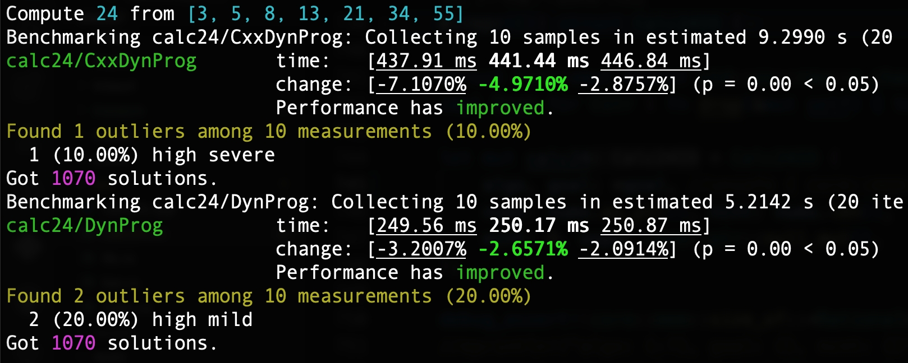
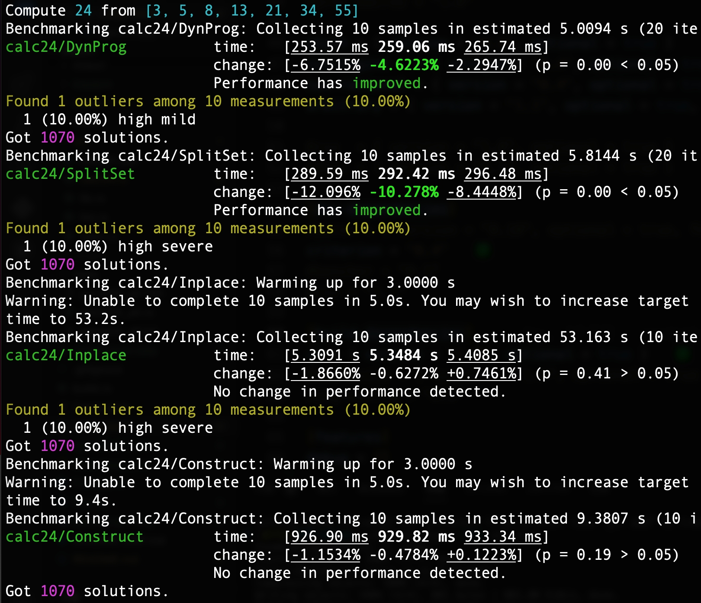
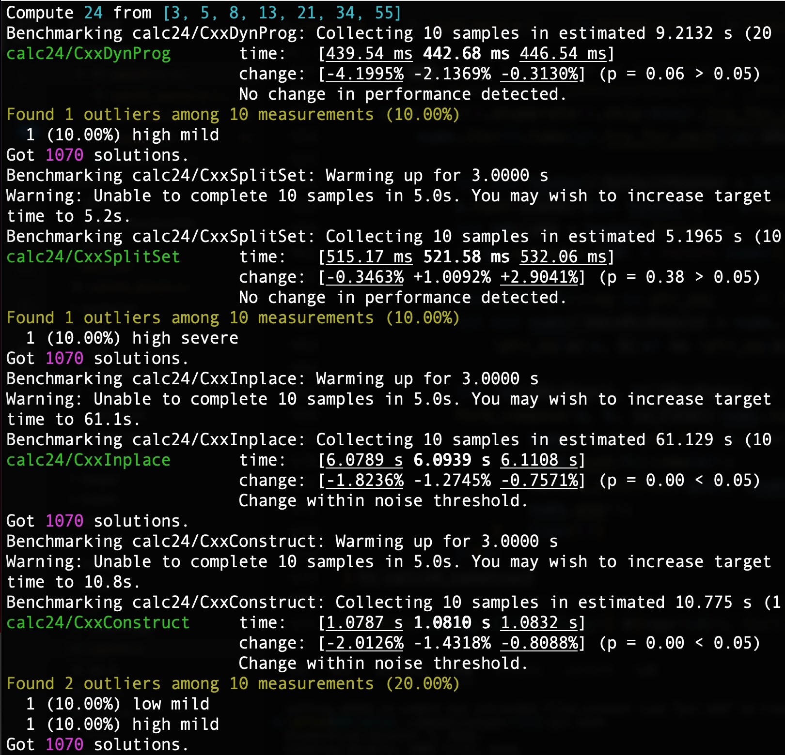

# Rust study project from scratch

A project to accumulate my knowledge about Rust programming and engineering.

## Solve [24 game/puzzle](https://zh.wikipedia.org/wiki/24点) calculation

**经典的 24 点计算**：给定任意 _4 个 1-10 或 1-13_ 的整数 (扑克牌数) ， 使用
`(+, -, *, /)` 四则计算和括号组合成算术表达式，使其计算结果为目标数 _24_ (30 以内因数最多的合数)；

**泛化的 '24' 点计算**：给定任意个 _有理数_， 使用 `(+, -, *, /)`
四则计算和括号组合算术成表达式，使其结果为某个任意给定的 _目标有理数_；

**并且要求去重**：只输出计算形式/方法/结构上 _唯一/不相同的所有_ 表达式结果；
(all algebraically unique/inequivalent solutions)

    Input integers/rationals for 24: 1 2 3 4
    1*2*3*4
    (1+3)*(2+4)
    4*(1+2+3)

    Input integers/rationals for 24: 8 8 3 3
    8/(3-8/3)

    Input integers/rationals for 24: g100 13 14 15 16 17
    ### Reset GOAL to 100 ###
    16+(17-14)*(13+15)
    (17-13)*(14+15)-16

PS: 另外用 [Yew](https://yew.rs) 框架开发了一个 [在线的交互界面](https://github.com/mhfan/inyew)。

### 自上而下分集计算法 (Top-down divide)

全搜索的 [计算复杂度](http://oeis.org/A140606)：
    `O(n) ~= ((2^{n-1} - 1) * 5) * ((2^{n-2} - 1) * 5) * ... * ((2^1 - 1) * 5)`

_动态规划_ vs _递归分解_

### 自下而上递归构造法 (Bottom-up construct)

全搜索的 [计算复杂度](http://oeis.org/A140606)：
    `O(n) ~= (C^2_n * 5) * (C^2_{n-1} * 5) * ... * (C^2_2 * 5)`

_在位递归构造_ vs _复制递归构造_

### 规避等价表达式

    prune repeated combinations by the same numbers and symmetries with hashmap (构造法只能对最后的完整表达式规避)；

    Commutativity (selecting a bias by lexicographical comparison);

    ((A . B) . b) => (A . (B . b)), kept the right sub-tree only;

    ((A / B) * b) => ((A * b) / B) if b != 1,
    (a * (A / B)) => ((a * A) / B) if a != 1, (1 * x) => kept in the final only,
    (a * (A * B)) => (A * (a * B)) if A  < a;

    ((A - B) + b) => ((A + b) - B) if b != 1,
    (a + (A - B)) => ((a + A) - B) if a != 0, (0 + x) => kept in the final only,
    (a + (A + B)) => (A + (a + B)) if A  < a;

    Asymmetric select subtraction by judging sign of the target/goal;
    (b - (B - A)) => ((b + A) - B), (x - 0) => (0 + x),
    ((A + x) - x) => kept in the final only;

    (a / (A / B)) => ((a * B) / A), (x / 1) => (1 * x), (0 / x) => (0 * x),
    ((x * B) / x) => ((x + B) - x);

### 同样的算法用 C++ 实现并对比性能

用 C++ 基本上复刻实现上述四种算法，在 **(Apple M1, macOS, Clang)** 上性能都比 Rust 的实现 _差_；
  通过 GitHub Action/workflow 的
  [CI 测试](https://github.com/mhfan/inrust/actions/runs/3254281354/jobs/5342349987) 观察，
  在 **(x86_64, Ubuntu, GCC)** 上 Rust 的实现也比 C++ 要 _快_；
  是因为 Rust 的 Rc 实现比 C++ 的 SharedPtr 的性能好？

Rust/C++ 版本前一类算法的性能都比后一类算法高一个数量级，个数越多性能差异越大；
但它们在当前的主流 PC 上计算 9-10 个数的时间就都难以忍受了；

## Code snippet gems

+ Game guess number
+ single linked list
+ 简单的幂集 (powerset) 算法
+ Fibonacci 数列迭代生成器
+ 流式 Pi 值计算
+ 命令管道

## 积累和 TODO

+ [ ] macro/proc-macro
+ [ ] SVG/XR/Game
+ [ ] concurrency
+ [ ] CodeLLDB
+ [x] crates.io
+ [x] (cargo-)[flamegraph](https://github.com/flamegraph-rs/flamegraph)
+ [x] benchmark/criterion
+ [x] C/C++ FFI & build.rs
+ [x] build timestamp & commit-ID
+ [x] Code [coverage](https://github.com/taiki-e/cargo-llvm-cov) automatically
+ [x] error propagation by question mark (`?`)
+ [x] cargo/crate/module/workspace organization
+ [x] internationalization (i18n) with [Fluent](https://projectfluent.org)
+ [x] UI/WebAssembly ([Yew](https://yew.rs)/[Perseus](https://framesurge.sh/perseus/en-US)/
  [Sycamore](https://sycamore-rs.netlify.app)/[Dioxus](https://dioxuslabs.com)/
  [slint](https://github.com/slint-ui/slint)/[egui](https://github.com/emilk/egui))
+ [x] Continuous Integration/Deployment (Github Action)
+ [x] Continuous (Unit/Integration/Doc/Fuzz) Test
+ [x] conditional compilation
+ [x] Rust programming

## References

### 24-Game Solver

+ <https://github.com/MaigoAkisame/enumerate-expressions>
+ <https://zhuanlan.zhihu.com/p/34015231>
+ <https://github.com/wiebemarten/gamemn>
+ <https://github.com/auntyellow/24>
+ <https://github.com/mhfan/smonde>
+ <https://4shu.net/theory/>
